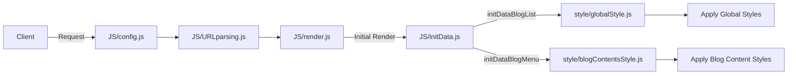
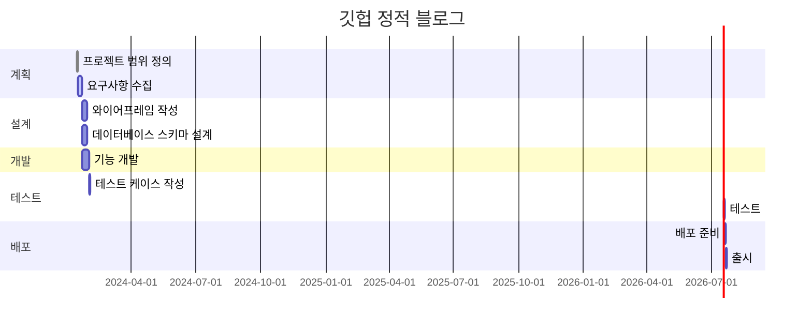

# github_blog
깃헙 정적 페이지 블로그 프로젝트: github에서 fork로 바로 blog를 만들 수 있는 정적 페이지 제공 프로젝트

* 사용방법
    1. github pages를 활성화 해주세요.
    2. 글을 작성하고 싶으면 `blog`에 `[date]_[title]_[category]_[thumnail]_[description].md` 형식으로 글을 작성해주세요. 섬네일을 비우고 싶다면 `[]`와 같이 빈 값으로 주세요.
    3. 추가 메뉴를 만들고 싶으면 `menu` 폴더에 `사용하고싶은 메뉴 이름.html` 형식으로 저장하면 메뉴로 생성됩니다.

* 서비스 URL 정보
    * 실행 URL: https://paullabkorea.github.io/github_blog/
    * blog github repo: https://github.com/paullabkorea/github_blog
    

* 기존 GitHub 블로그와 비교
    * 기존 지킬 블로그에 비해 사용법이 단순
        * fork 후 pages 설정만 하면 blog 제작 가능
    * 커스터마이징에 난이도 단순
        * config.js 파일 수정으로 커스터마이징
        * style 파일 수정으로 커스터마이징
        * 빌드 시스템으로 되어 있지 않아 JS를 알면 직접 커스터마이징 가능
    * 블로그 글을 컴파일 없이 확인 가능

* 구조

* 폴더 트리

| 폴더명 | 파일명 | 함수 | 변수 | 비고 |
|--------|--------|------|------|------|
| style  | globalStyle.js | | | 전역 스타일 설정 |
| style  | blogContentsStyle.js | | | 블로그 컨텐츠 스타일 설정 |
| JS     | config.js | | siteConfig | 사이트 설정 정보 |
| JS     | URLparsing.js | extractFromUrl() | | URL 파싱 |
| JS     | render.js | renderBlogPosts(), renderMenu() | | 데이터를 DOM에 렌더링 |
| JS     | initData.js | initDataBlogList(), initDataBlogMenu() | blogList, blogMenu | 초기 데이터 로딩 |

* WBS

* 과업
    * 각 블로그 글에 뒤로 가기 버튼 만들기
    * 'blog.md'파일을 어떻게 할지 의사결정 필요
    * 메인 페이지 스타일링
    * API 호출 최소화

* 참고
    * https://github.blog/category/engineering/ 스타일을 참고