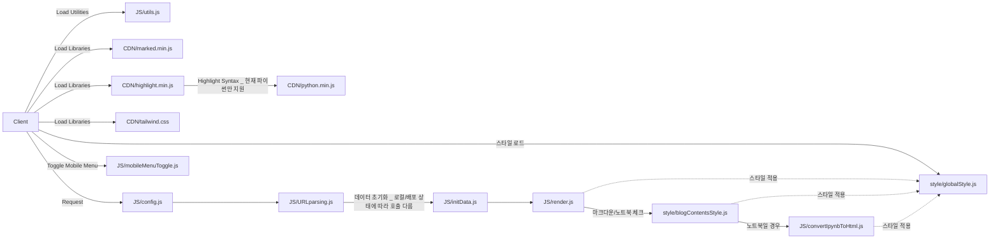
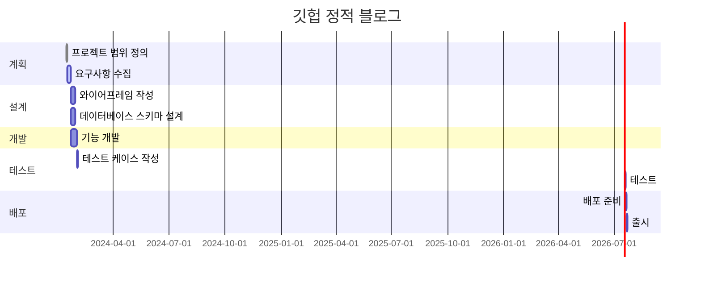
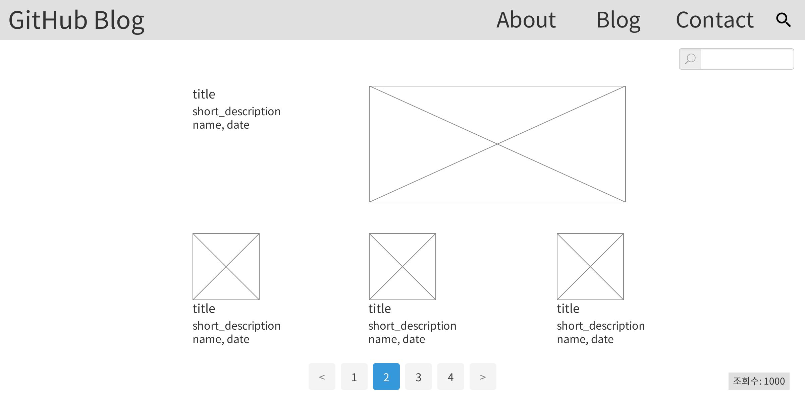
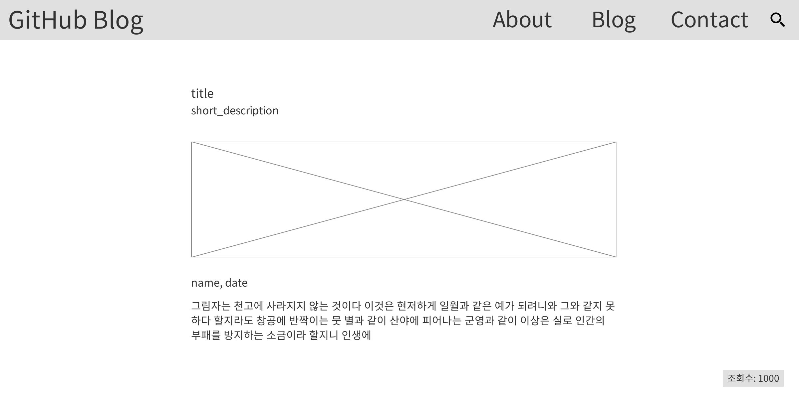
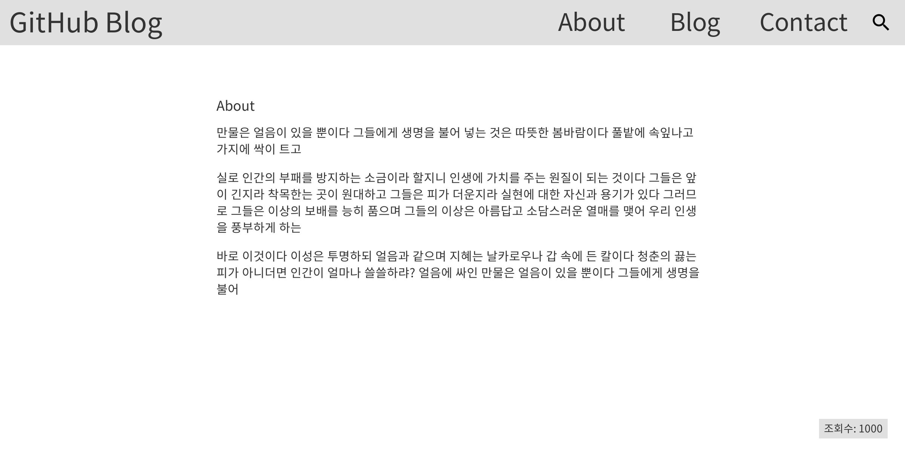
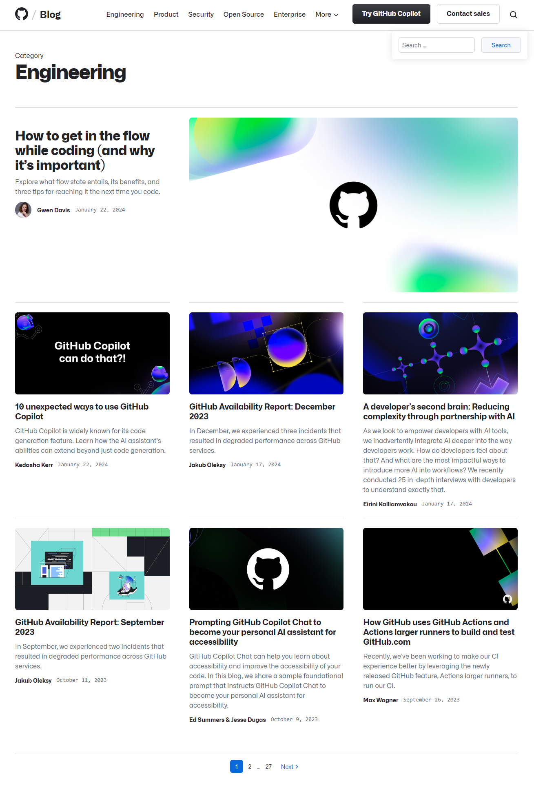
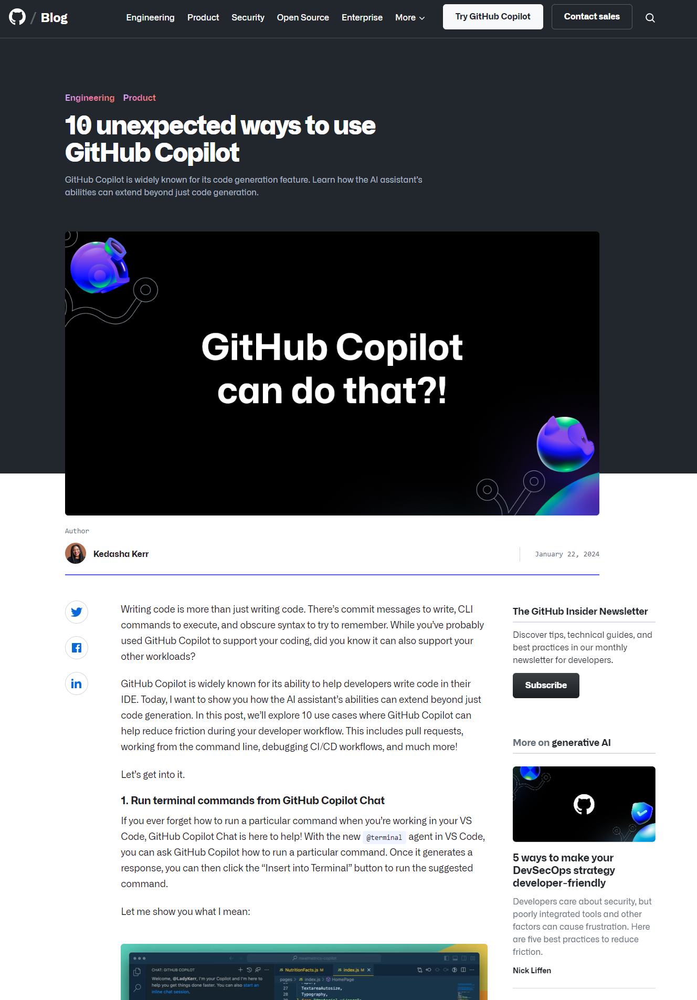
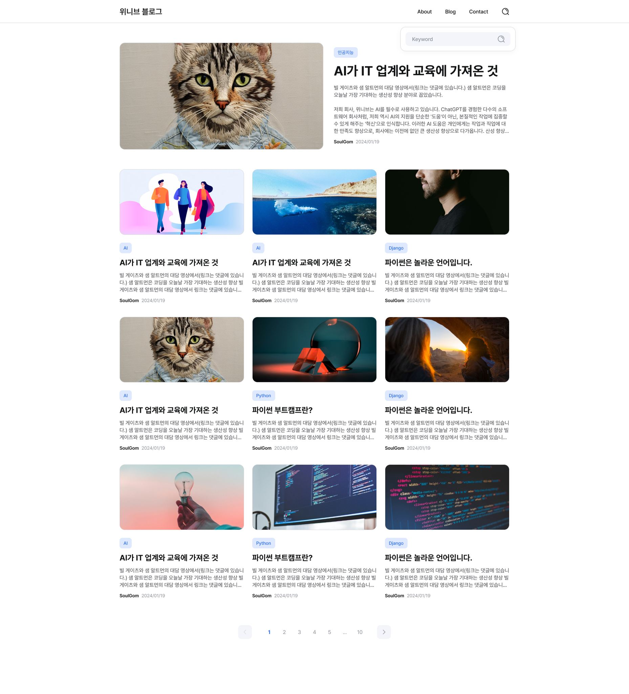
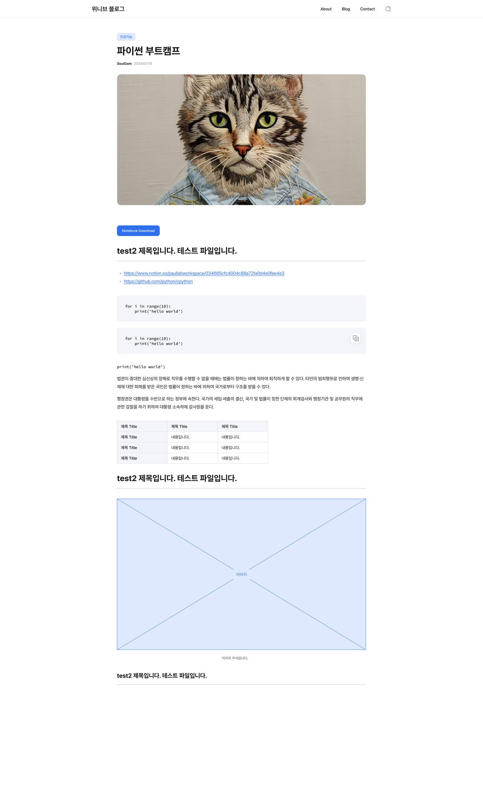

# github_blog

깃헙 정적 페이지 블로그 프로젝트
_ 현재 이 프로젝트는 위니브로 이관되어 관리중입니다.
_ 개인 repo는 위니브 회사 repo로 이관되어 더이상 업데이트 되지 않습니다.

- 목표

  - github에서 fork로 바로 blog를 만들 수 있는 정적 페이지 제공 프로젝트
  - 학생에게 프로젝트 양식 샘플 제공(https://github.com/weniv/project_sample_repo), 개인 repo로 연결하여 양식 제공 중
    - 추후 이 README는 프로젝트 양식이 아니라 메뉴얼 양식으로 변경할 수 있음
  - 회사 주피터 노트북 등 지적 재산을 누적하기 위한 블로그 프로젝트

- 사용방법

  1. github pages를 활성화 해주세요.
  2. 글을 작성하고 싶으면 `blog`에 `[date]_[title]_[category]_[thumnail]_[description].md` 형식(`md`, `ipynb` 호환)으로 글을 작성해주세요. 섬네일을 비우고 싶다면 `[]`와 같이 빈 값으로 주세요.
  3. 추가 메뉴를 만들고 싶으면 `menu` 폴더에 `사용하고싶은 메뉴 이름.html` 형식으로 저장하면 메뉴로 생성됩니다.

- 서비스 URL 정보

  - 실행 URL: https://weniv.github.io/weniv_blog/
  - blog github repo: https://github.com/weniv/github_blog

- 기존 GitHub 블로그와 비교

  - 기존 지킬 블로그에 비해 사용법이 단순
    - fork 후 pages 설정만 하면 blog 제작 가능
  - 커스터마이징에 난이도 단순
    - config.js 파일 수정으로 커스터마이징
    - style 파일 수정으로 커스터마이징
    - 빌드 시스템으로 되어 있지 않아 JS를 알면 직접 커스터마이징 가능
  - 블로그 글을 컴파일 없이 확인 가능
  - ipynb에 대한 블로깅 가능

- 구조



- 중요 의사결정

  - 서비스 고도화에 따라 의사결정이 필요한 부분 정리
    - local_blogList.json과 local_blogMenu.json를 사용자에게 작성하게 하면 무제한으로 API를 활용할 수 있음

- 폴더 트리

  | 폴더명 | 파일명               | 함수                                   | 변수                                         | 비고                          |
  | ------ | -------------------- | -------------------------------------- | -------------------------------------------- | ----------------------------- |
  | style  | globalStyle.js       |                                        |                                              | 전역 스타일 설정              |
  | style  | blogContentsStyle.js |                                        |                                              | 블로그 컨텐츠 스타일 설정     |
  | JS     | config.js            |                                        | siteConfig                                   | 사이트 설정 정보              |
  | JS     | URLparsing.js        | extractFromUrl()                       | url(url obj), pathParts(쿼리스트링), isLocal | URL 파싱, 스키마 확인         |
  | JS     | render.js            | renderBlogPosts(), renderMenu()        |                                              | 데이터를 DOM에 렌더링         |
  | JS     | initData.js          | initDataBlogList(), initDataBlogMenu() | blogList, blogMenu                           | 초기 데이터 로딩, 스키마 확인 |

- 코드 컨벤션과 변수 컨벤션

  - 변수명(함수명): 역할
    - blogList(initDataBlogList): (fetch) repo에서 blog폴더에 있는 파일 명을 정규표현식으로 파싱, 데이터가 이미 있다면 다시 통신하지 않음.
    - blogMenu(initDataBlogMenu): (fetch) repo에서 menu폴더에 있는 파일 명을 파싱, 데이터가 이미 있다면 다시 통신하지 않음.
    - posts: (fetch) post의 정보를 가져와 데이터 저장, 재접속시 , 데이터가 이미 있다면 다시 통신하지 않음.
    - url
      - url: 현재 url
      - pathParts: split된 url
      - origin: href + pathname
    - isLocal: 로컬과 배포여부

- WBS



- 데이터베이스 스키마 및 중요 변수

  - localDataUsing: 로컬 데이터 사용 여부
  - isInitData: 데이터 초기화 여부, 데이터가 없을 경우 무한루프 방지를 위해 사용

  - siteConfig

    - username: GitHub 사용자 이름
    - repositoryName: GitHub 저장소 이름
    - mainColor: 사이트의 주 색상
    - textColor: 기본 텍스트 색상
    - blogTitle: 블로그 제목

  - users

    - id: 사용자 id
    - username: 사용자 이름
    - company: 사용자 회사
    - grade: 사용자 직급
    - img: 사용자 이미지

  - url(URLparsing)

    | 키       | 설명                       | 예시 값                            |
    | -------- | -------------------------- | ---------------------------------- |
    | hash     | 해시값 (URL의 # 이후 부분) | ""                                 |
    | host     | 호스트명과 포트번호        | "127.0.0.1:5500"                   |
    | hostname | 호스트명 (포트번호 제외)   | "127.0.0.1"                        |
    | href     | 전체 URL                   | "http://127.0.0.1:5500/index.html" |
    | origin   | 프로토콜과 호스트          | "http://127.0.0.1:5500"            |
    | password | 비밀번호 (있을 경우)       | ""                                 |
    | pathname | 도메인 이후의 경로         | "/index.html"                      |
    | port     | 포트 번호                  | "5500"                             |
    | protocol | 사용된 프로토콜            | "http:"                            |
    | search   | 쿼리 문자열 (있을 경우)    | ""                                 |

  - blogList, BlogMenu(GitHub API)

    | Key          | 설명                                       | 예시 값                                                                                                                                                                                                                |
    | ------------ | ------------------------------------------ | ---------------------------------------------------------------------------------------------------------------------------------------------------------------------------------------------------------------------- |
    | name         | 파일 이름                                  | "about.md", "blog.md"                                                                                                                                                                                                  |
    | path         | 파일 경로                                  | "menu/about.md", "menu/blog.md"                                                                                                                                                                                        |
    | sha          | 파일의 SHA 체크섬                          | "0953...d5b25", "7f34...f354f"                                                                                                                                                                                         |
    | size         | 파일 크기 (바이트)                         | 856, 6                                                                                                                                                                                                                 |
    | url          | 파일의 API URL                             | "https://api.github.com/repos/paullabkorea/github_blog/contents/menu/about.md?ref=main", "https://api.github.com/repos/paullabkorea/github_blog/contents/menu/blog.md?ref=main"                                        |
    | html_url     | 파일의 GitHub 페이지 URL                   | "https://github.com/paullabkorea/github_blog/blob/main/menu/about.md", "https://github.com/paullabkorea/github_blog/blob/main/menu/blog.md"                                                                            |
    | git_url      | 파일의 Git 블롭 URL                        | "https://api.github.com/repos/paullabkorea/github_blog/git/blobs/095349309b14d370ddae691e1e29a753300d5b25", "https://api.github.com/repos/paullabkorea/github_blog/git/blobs/7f347a7d841ac1d1e1cfb1ae12c967e83d1f354f" |
    | download_url | 파일을 다운로드할 수 있는 URL              | "https://raw.githubusercontent.com/paullabkorea/github_blog/main/menu/about.md", "https://raw.githubusercontent.com/paullabkorea/github_blog/main/menu/blog.md"                                                        |
    | type         | 파일 타입                                  | "file"                                                                                                                                                                                                                 |
    | \_links      | 관련 링크 (자기 자신, Git, HTML 링크 포함) | 내부 링크 객체                                                                                                                                                                                                         |

- 화면 정의서
    <table>
        <tr>
            <th>메인화면</th>
            <th>설명</th>
        </tr>
        <tr>
            <td width="70%">
                
            </td>
            <td>
                <ul>
                    <li>목록 필요</li>
                    <li>URL 파싱 및 URL 변경 필요</li>
                    <li>목록을 6개씩 잘라내어 넘어가게 하거나 무한스크롤 구현</li>
                    <li>가장 최신의 게시물을 맨 위에 게시</li>
                </ul>
            </td>
        </tr>
    </table>
    <table>
        <tr>
            <th>포스트 화면</th>
            <th>설명</th>
        </tr>
        <tr width="70%">
            <td width="70%">
                
            </td>
            <td>
                <ul>
                    <li>목록을 불러오는 것이 불필요 하지만 검색 버튼을 눌렀을 경우 목록을 불러올 필요가 있음</li>
                    <li>URL 파싱 및 URL 변경 필요</li>
                    <li>posts 변수에 담아 다른 페이지 이동 후 재접속 할 때 다시 통신하지 않게 처리</li>
                </ul>
            </td>
        </tr>
    </table>
    <table>
        <tr>
            <th>그 외 메뉴 화면</th>
            <th>설명</th>
        </tr>
        <tr>
            <td width="70%">
                
            </td>
            <td>
                <ul>
                    <li>목록을 불러오는 것이 불필요 하지만 검색 버튼을 눌렀을 경우 목록을 불러올 필요가 있음</li>
                    <li>URL 파싱 및 URL 변경 필요</li>
                </ul>
            </td>
        </tr>
    </table>

- 과업

  - ~~메인 클릭했을 때 a로 이동하는 것이 아닌 blog.md 페이지로 이동하게 함으로 히스토리 유지 필요~~
  - 이미지
    - ~~favicon~~
    - ~~default 이미지~~
  - 이미지는 썸네일 이미지와 게시물 이미지를 폴더 분리하는 것이 좋을지
    - 사용자 편의성은 분리하지 않는 것이 좋을 수 있음
  - ~~CDN은 모두 로컬에서 추가 하도록 변경~~
  - 위니브를 알릴 수 있는 몇 가지 장치를 해둘 것
    - ~~위니브 캐릭터 프로필 이미지 5 ~ 6개 (남3, 여3)~~
    - default 이미지를 우리 케릭터 이미지로 => 호불호가 있을 수 있음
      - thumbnail 폴더로 관리하려고 했으나, 파일명에 /가 들어가는 경우 폴더로 처리되어 img에 포함
  - 서비스에서 GitHub API 연동하여 여러 서비스 지원
    - 업데이트 히스토리 볼 수 있도록 할 것인지 논의 필요
    - 잔디를 볼 수 있도록 할 것인지 논의 필요
    - 주요 스택들이나 코드를 짠 횟수 등을 보게 할 것인지 논의 필요
  - 사용자가 config.js 잘못 입력했을 때 작동되게 할지 의사 결정 필요 => 사용자에게 디버깅 능력이 없으므로
  - ~~page navigation을 어떻게 할 것인지 논의 필요(무한 스크롤은 Drop)~~
    - 2000개 정도의 블로그 글은 지연없이 로딩
      - 이미지가 고화질이면 로딩 시간이 길어질 수 있음
      - 이미지가 고화질일 경우 대책 필요
  - ~~localDataUsing에 따른 분기~~
    - localDataUsing이 true일 경우
      - local_bloghumbList.json과 local_blogMenu.json을 사용
    - localDataUsing이 false일 경우
      - GitHub API를 사용
  - config.js에 있는 username과 repo name이 실제로 필요하지 않음(의사결정 필요)
    - URL 파싱하면 됨. 사용자 편의를 위해서는 이렇게 하면 좋지 않을까 생각
    - 뒤에 index.html이 있는 경우 error가 자주 발생됨 => URL 파싱을 통해 해결 필요
  - ~~블로그 figma style 반영~~
  - ~~'blog.md'파일을 어떻게 할지 (의사결정 필요)~~
  - 조회수
  - disqus 댓글
  - 한국어 가이드, 영어 가이드
  - GitHub 스폰서 등록(위니브 계정으로 이관 후)
  - 검색 결과가 없을 때 화면
  - 블로그 글에서 새로고침 시 키워드 aside 출력 안되는 오류 수정
  - **배포 전 확인 사항**
    - 이미지 최적화 되어있는지 확인(용량)
    - 이미지 갯수를 더 늘릴지 논의
    - local_blogList.json과 local_blogMenu.json를 내용을 비워두어도 배포상에서 작동 되는지 확인
    - config.js에 있는 localDataUsing 변수를 true로 했을 때 local_blogList.json과 local_blogMenu.json에서만 데이터 읽어오는지 확인
    - 실제 필요하지 않은 변수 정리
    - 코드와 변수 정리
    - 메뉴얼 정리
    - logo 폰트 확인

- 애러와 애러 해결(트러블슈팅 히스토리)

  - 아래 URL로 바로 접속시 콘텐츠가 보이지 않고, 카테고리를 클릭해도 검색이 되지 않음. 카테고리로 들어갔다가 뒤로가기를 누르면 콘텐츠가 보이지 않음
    - http://127.0.0.1:5500/?post=%5B20240225%5D_%5B%ED%83%80%EC%9D%B4%ED%8B%80%EC%9D%84+%EC%9E%85%EB%A0%A5%ED%95%A9%EB%8B%88%EB%8B%A419%5D_%5BTest%5D_%5B%5D_%5B%ED%85%8C%EC%8A%A4%ED%8A%B8%EC%9A%A9%EC%9E%85%EB%8B%88%EB%8B%A4%5D_%5B%5D.md
      - 보이지 않는 것은 실제 존재하는 파일이 아니고 테스트 코드였기 때문. 이것을 해결하기 위해 수백개의 test 데이터를 생성하는 py 파일을 생성
      - 카테고리가 보이지 않는 것은 API 호출 최소화를 위해 바로 접속했을 시 목록을 업데이트 하지 않았기 때문. 이것을 해결하기 위해 클릭시 API 호출을 통해 목록을 업데이트 하는 것으로 수정.
      ```js
      if (blogList.length === 0) {
        initDataBlogList();
      }
      ```
  - 모바일 메뉴 설계
    - 모바일 메뉴와 데스스탑 메뉴를 2개 만드는 일을 이벤트 위임을 통해 해결해야 했으나 중복코드가 발생하더라도 시간을 절약하는 차원에서 모듈화 하지 않음.
  - API 호출 최소화
    - API 호출을 최소화 하여 하루 200번의 호출을 아낄 수 있도록 코드를 짜다보니 많은 부분에서 모듈화가 과하게 들어감. 구조가 다소 복잡해짐.
  - 사용자의 사용 복잡도
    - 만약 local_blogList.json을 사용자가 작성할 수 있다면 API 호출이 필요 없음. 이것을 가능하게 하는 코드는 프로젝트 흥행과 더불어 진행.
    - 또는 사용자가 이것을 선택할 수 있는 옵션 설정
  - 로컬에서 제대로 작동하지만 배포해서는 작동하지 않는 이슈가 있음. 아직 미해결.
    - URLpasing이 잘못되었다는 것을 확인. local에서는 origin에 port 붙이고 뒤에 쿼리스트링을 붙였고 github에서는 `https://paullabkorea.github.io/github_blog/`구조인데 `https://paullabkorea.github.io/`로 파싱되어 `https://paullabkorea.github.io/?menu=about`식으로 저장되고 있었음.
    - `new URL(window.location.href)`와 `new URL('https://paullabkorea.github.io/github_blog/?menu=about')`를 테스트하여 서버에서도 동작하도록 수정
  - `https://paullabkorea.github.io/github_blog/?post=%5B20240122%5D_%5BAI%EA%B0%80+IT+%EC%97%85%EA%B3%84%EC%99%80+%EA%B5%90%EC%9C%A1%EC%97%90+%EA%B0%80%EC%A0%B8%EC%98%A8+%EA%B2%83%5D_%5BAI%5D_%5B%EB%B9%8C%EA%B2%8C%EC%9D%B4%EC%B8%A0_%EC%83%98%EC%95%8C%ED%8A%B8%EB%A8%BC.jpg%5D_%5B%EB%B9%8C+%EA%B2%8C%EC%9D%B4%EC%B8%A0%EC%99%80+%EC%83%98+%EC%95%8C%ED%8A%B8%EB%A8%BC%EC%9D%98+%EB%8C%80%ED%99%94+%EC%A4%91+AI%EC%97%90+%EC%97%AD%ED%95%A0%EC%97%90+%EB%8C%80%ED%95%B4%5D.md` 로 접속시 `https://paullabkorea.github.io/github_blog/?post=undefined`로 URL이 변경되는 케이스 발견
    - URL 변경을 origin 기준이 아니라 href에서 host + repo 이름으로 변경
  - 주피터노트북 변환에서 ipynb 파일 안에 code가 `f'<h1>hello</h1>'`으로 되어 있으면 h1으로 해석되는 경우가 생김
    - map이나 filter 변환에도 같은 이슈가 있어서 코드블록은 엔티티 코드로 변환
    - (해결중) 이렇게 해결하니 pandas의 dateframe은 테이블로 표시되지 않는 사이드 이펙트 발생
  - ipynb에서 ul과 li 아래 p태그가 생겨 개행
    - `\n`을 별도로 처리
  - 검색창 이벤트 버블링
    - 아래 코드로 이벤트 버블링 해결
      ```javascript
      searchInput.onclick = (event) => {
        event.stopPropagation();
      };
      ```
  - 검색기능 구현 후 UI가 깨지는 문제 발생
    - figma style이 나왔기 때문에 기존에 tailwind style만 유지
    - 계산했던 모든 style 제거
  - code 블록 style 변경 건

    - 아래와 같은 코드를 테스트한 결과 a11y 테마가 가장 적합하다고 판단

    ```html
    <!-- 테마 변경 Test -->
    <!-- 테마 1: 기본 테마 -->
    <!-- <link
        rel="stylesheet"
        href="https://cdnjs.cloudflare.com/ajax/libs/highlight.js/11.9.0/styles/default.min.css"
    /> -->
    <!-- 테마 2: 깃헙 테마 -->
    <!-- <link
        rel="stylesheet"
        href="https://cdnjs.cloudflare.com/ajax/libs/highlight.js/11.9.0/styles/github.min.css"
    /> -->
    <!-- 테마 3: monokai 테마 -->
    <!-- <link 
        rel="stylesheet" 
        href="https://cdnjs.cloudflare.com/ajax/libs/highlight.js/11.9.0/styles/monokai.min.css"
    /> -->
    ```

  - GitHub에서 마크다운 블록에스 ul > li가 2개 이상 들어가 있는 경우 개행이 되는 이슈 발견, 애스터리스크 뒤에 텍스트가 나오지 않고 한칸 개행되어 p태그로 텍스트가 들어오게 됨.

    - 아래 코드로 임시 해결

    ```css
    .markdown-cell > ul > li > p {
      display: inline-block;
    }
    ```

    - p 태그가 생성되는 이유를 찾아 해결하는 것이 근본적인 해결책이 될 것으로 보임

  - 뒤로가기 기능 구현

    - 뒤로 갔을 때 블로그 리스트가 아니라 `blog.md` 파일을 읽어서 렌더링하는 이슈 발생
    - 해당 문제를 해결하기 위해 URLparsing.js에 아래 함수를 구현하여 해결
    - 모든 코드를 다 옮겨놓은 이유는 3가지 케이스 외에 더 있을 수 있기 때문, 추후 문제가 더 발생할 여지가 있으므로 트러블 슈팅에 기록.

    ```javascript
    window.addEventListener("popstate", (event) => {
      // 뒤로 가는 것은 3가지 케이스가 있을 수 있음
      // 1. 뒤로 갔을 때 메인 페이지(/), 뒤로 갔을 때 블로그 리스트 페이지(/?menu=blog.md) (실제로는 동일)
      // 2. 뒤로 갔을 때 menu 페이지(/?menu=about.md)
      // 3. 뒤로 갔을 때 post 페이지(/?post=20210601_[제목]_[카테고리]_[썸네일]_[저자].md)

      // 렌더링이 이미 된 것은 category, init, blogList, blogMenu

      // 뒤로간 url을 가져옴
      let url = new URL(window.location.href);

      if (!url.search.split("=")[1] || url.search.split("=")[1] === "blog.md") {
        // 블로그 리스트 로딩
        renderBlogList();
      } else if (url.search.split("=")[0] === "?menu") {
        // 메뉴 상세 정보 로딩
        // console.log('menu', url.search.split("=")[1])
        document.getElementById("blog-posts").style.display = "none";
        document.getElementById("contents").style.display = "block";
        // console.log(origin + "menu/" + url.search.split("=")[1])
        fetch(origin + "menu/" + url.search.split("=")[1])
          .then((response) => response.text())
          .then((text) => {
            // console.log(text)
            styleMarkdown("menu", text);
          });
      } else if (url.search.split("=")[0] === "?post") {
        // 블로그 상세 정보 로딩
        if (url.search.split("=")[0] === "?menu") {
          document.getElementById("blog-posts").style.display = "none";
          document.getElementById("contents").style.display = "block";
          fetch(origin + "menu/" + url.search.split("=")[1])
            .then((response) => response.text())
            .then((text) => styleMarkdown("menu", text));
        } else if (url.search.split("=")[0] === "?post") {
          document.getElementById("contents").style.display = "block";
          document.getElementById("blog-posts").style.display = "none";
          postNameDecode = decodeURI(url.search.split("=")[1]).replaceAll(
            "+",
            " "
          );
          // console.log(postNameDecode);
          postInfo = extractFileInfo(postNameDecode);
          fetch(origin + "blog/" + postNameDecode)
            .then((response) => response.text())
            .then((text) =>
              postInfo.fileType === "md"
                ? styleMarkdown("post", text, postInfo)
                : styleJupyter("post", text, postInfo)
            );
        }
      } else {
        alert("잘못된 URL입니다.");
      }
    });
    ```

- 참고

  - https://github.blog/category/engineering/ 스타일을 참고
  <table>
      <tr>
          <th>레퍼런스 이미지 메인</th>
      </tr>
      <tr>
          <td></td>
      </tr>
  </table>
  <table>
      <tr>
          <th>레퍼런스 이미지 블로그</th>
      </tr>
      <tr>
          <td></td>
      </tr>
  </table>

- 회사 프로젝트로 이관 후 figma 최종 시안
  - https://www.figma.com/file/bSWDeccRzm173J1VjvsiUu/위니브-(깃헙)블로그?type=design&node-id=1%3A22&mode=design&t=T258gDIJwM1T3iMW-1
  <table>
      <tr>
          <th>이미지 메인</th>
      </tr>
      <tr>
          <td></td>
      </tr>
  </table>
  <table>
      <tr>
          <th>블로그</th>
      </tr>
      <tr>
          <td></td>
      </tr>
  </table>
