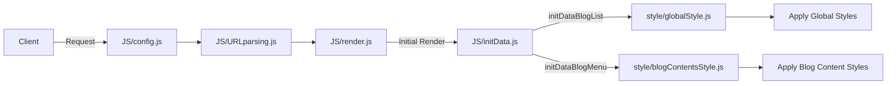
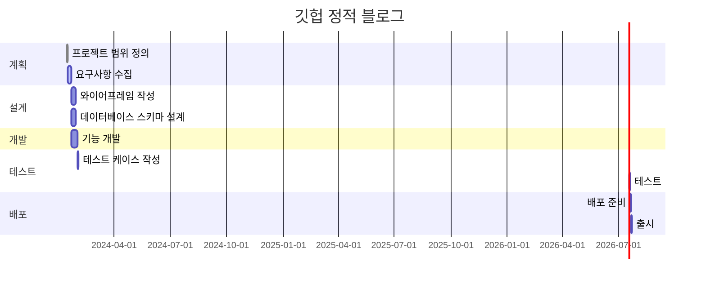

# github_blog
깃헙 정적 페이지 블로그 프로젝트: github에서 fork로 바로 blog를 만들 수 있는 정적 페이지 제공 프로젝트

* 사용방법
    1. github pages를 활성화 해주세요.
    2. 글을 작성하고 싶으면 `blog`에 `[date]_[title]_[category]_[thumnail]_[description].md` 형식으로 글을 작성해주세요. 섬네일을 비우고 싶다면 `[]`와 같이 빈 값으로 주세요.
    3. 추가 메뉴를 만들고 싶으면 `menu` 폴더에 `사용하고싶은 메뉴 이름.html` 형식으로 저장하면 메뉴로 생성됩니다.

* 서비스 URL 정보
    * 실행 URL: https://paullabkorea.github.io/github_blog/
    * blog github repo: https://github.com/paullabkorea/github_blog
    

* 기존 GitHub 블로그와 비교
    * 기존 지킬 블로그에 비해 사용법이 단순
        * fork 후 pages 설정만 하면 blog 제작 가능
    * 커스터마이징에 난이도 단순
        * config.js 파일 수정으로 커스터마이징
        * style 파일 수정으로 커스터마이징
        * 빌드 시스템으로 되어 있지 않아 JS를 알면 직접 커스터마이징 가능
    * 블로그 글을 컴파일 없이 확인 가능

* 구조

* 폴더 트리

    | 폴더명 | 파일명 | 함수 | 변수 | 비고 |
    |--------|--------|------|------|------|
    | style  | globalStyle.js | | | 전역 스타일 설정 |
    | style  | blogContentsStyle.js | | | 블로그 컨텐츠 스타일 설정 |
    | JS     | config.js | | siteConfig | 사이트 설정 정보 |
    | JS     | URLparsing.js | extractFromUrl() | url(url obj), pathParts(쿼리스트링), isLocal | URL 파싱, 스키마 확인 |
    | JS     | render.js | renderBlogPosts(), renderMenu() | | 데이터를 DOM에 렌더링 |
    | JS     | initData.js | initDataBlogList(), initDataBlogMenu() | blogList, blogMenu | 초기 데이터 로딩, 스키마 확인 |

* 코드 컨벤션과 변수 컨벤션(정리 필요)
    * blog
    * post
    * post_list

* WBS

* 데이터베이스 스키마
    * url(URLparsing)

        | 키       | 설명                         | 예시 값                       |
        |----------|-----------------------------|-----------------------------|
        | hash     | 해시값 (URL의 # 이후 부분)   | ""                          |
        | host     | 호스트명과 포트번호           | "127.0.0.1:5500"            |
        | hostname | 호스트명 (포트번호 제외)      | "127.0.0.1"                 |
        | href     | 전체 URL                     | "http://127.0.0.1:5500/index.html" |
        | origin   | 프로토콜과 호스트            | "http://127.0.0.1:5500"     |
        | password | 비밀번호 (있을 경우)          | ""                          |
        | pathname | 도메인 이후의 경로            | "/index.html"               |
        | port     | 포트 번호                    | "5500"                      |
        | protocol | 사용된 프로토콜               | "http:"                     |
        | search   | 쿼리 문자열 (있을 경우)       | ""                          |

    * blogList, BlogMenu(GitHub API)

        | Key           | 설명                                         | 예시 값 |
        |---------------|---------------------------------------------|---------|
        | name          | 파일 이름                                    | "about.md", "blog.md" |
        | path          | 파일 경로                                    | "menu/about.md", "menu/blog.md" |
        | sha           | 파일의 SHA 체크섬                            | "0953...d5b25", "7f34...f354f" |
        | size          | 파일 크기 (바이트)                           | 856, 6 |
        | url           | 파일의 API URL                               | "https://api.github.com/repos/paullabkorea/github_blog/contents/menu/about.md?ref=main", "https://api.github.com/repos/paullabkorea/github_blog/contents/menu/blog.md?ref=main" |
        | html_url      | 파일의 GitHub 페이지 URL                     | "https://github.com/paullabkorea/github_blog/blob/main/menu/about.md", "https://github.com/paullabkorea/github_blog/blob/main/menu/blog.md" |
        | git_url       | 파일의 Git 블롭 URL                          | "https://api.github.com/repos/paullabkorea/github_blog/git/blobs/095349309b14d370ddae691e1e29a753300d5b25", "https://api.github.com/repos/paullabkorea/github_blog/git/blobs/7f347a7d841ac1d1e1cfb1ae12c967e83d1f354f" |
        | download_url  | 파일을 다운로드할 수 있는 URL                | "https://raw.githubusercontent.com/paullabkorea/github_blog/main/menu/about.md", "https://raw.githubusercontent.com/paullabkorea/github_blog/main/menu/blog.md" |
        | type          | 파일 타입                                   | "file" |
        | _links        | 관련 링크 (자기 자신, Git, HTML 링크 포함)   | 내부 링크 객체 |

* 화면 정의서
    <table>
        <tr>
            <th>메인화면</th>
            <th>설명</th>
        </tr>
        <tr>
            <td width="70%">
                
            </td>
            <td>
                <ul>
                    <li>설명 하나</li>
                    <li>설명 하나</li>
                    <li>설명 하나</li>
                </ul>
            </td>
        </tr>
    </table>
    <table>
        <tr>
            <th>포스트 화면</th>
            <th>설명</th>
        </tr>
        <tr width="70%">
            <td width="70%">
                
            </td>
            <td>
                <ul>
                    <li>설명 하나</li>
                    <li>설명 하나</li>
                    <li>설명 하나</li>
                </ul>
            </td>
        </tr>
    </table>
    <table>
        <tr>
            <th>그 외 메뉴 화면</th>
            <th>설명</th>
        </tr>
        <tr>
            <td width="70%">
                
            </td>
            <td>
                <ul>
                    <li>설명 하나</li>
                    <li>설명 하나</li>
                    <li>설명 하나</li>
                </ul>
            </td>
        </tr>
    </table>

* 과업
    * 동작하게 아키텍처 다듬기
    * style은 모두 global이나 blogContentsStyle에서 수정하게 변경
        * createCardElement에 있는 스타일도 모두 global로 이동
    * 각 블로그 글에 뒤로 가기 버튼 만들기
    * 검색 기능
    * 'blog.md'파일을 어떻게 할지 의사결정 필요
    * 메인 페이지 스타일링
    * API 호출 최소화
        * ?Postlist=1: 목록을 호출할 필요 없음
        * ?없을 때에는 목록을 호출할 필요 있음
    * 페이지에 2개의 contents 영역이 block, none으로 표시되고 있는 것을 처리
    * grid 스타일링
    * user 정보 입력
        * default는 config
        * 다른 분들과 함께 집필할 때에는 호출하게
    * 와이어프레임
    * 기획 문서 기획 서적 참고하여 수정
    * url 변경

* 참고
    * https://github.blog/category/engineering/ 스타일을 참고
    <table>
        <tr>
            <th>레퍼런스 이미지 메인</th>
        </tr>
        <tr>
            <td></td>
        </tr>
    </table>
    <table>
        <tr>
            <th>레퍼런스 이미지 블로그</th>
        </tr>
        <tr>
            <td></td>
        </tr>
    </table>